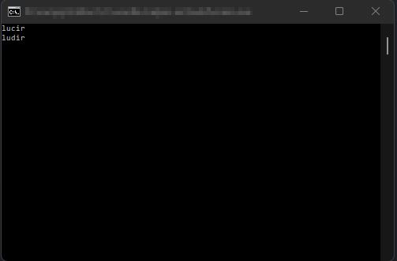

# wordle-helper-es

Helper tool to cheat at Wordle (Spanish)

This is a very stupid program that filters the list of possibilities at Wordle.

A good strategy is to use the words "turia" and "moles" to start the game:


Then record the results:

```C
// src/main.c:182
// AddToPattern(
//  struct:  Defined earlier in the code
//  word:   Just for convenience, the character `&` represents `ñ`
//  result: 'v' = green, 'a' = yellow, 'g' = grey
//)
AddToPattern(&p, "turia", "gvavg");
AddToPattern(&p, "moles", "ggagg");
```

Compile and execute using `build.sh`:



Try:


After several tests the result is: most of the times the game is solved at third round.

Again: this program is really stupid and I didn't even put effort on the code. It is just a test.
